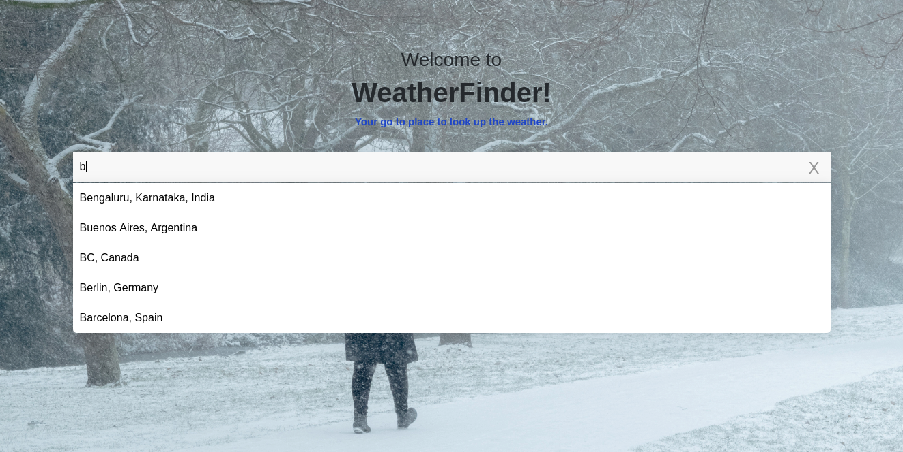
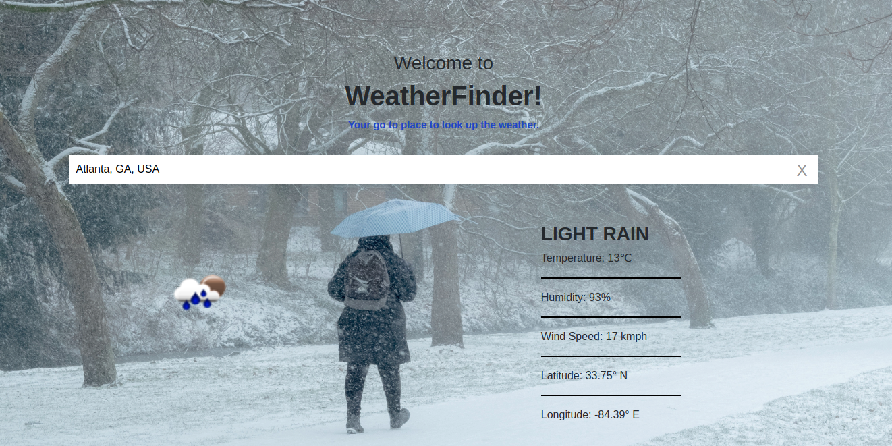
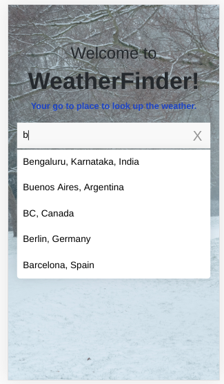
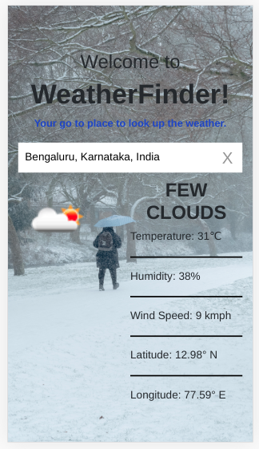

# WeatherFinder

A React and Django web-app that display weather based on the city entered by the user.

## Features

##### Start typing a city name and autosuggestions will appear

###### Autosuggestions in Desktop


###### Weather information


###### Respoonsive React App - works well in tablet and mobile views
<div style="margin: 0 auto">
    
    
</div>

## Installation Instructions

- After cloning the repository, `cd` into it and run following commands:

```
# Create a virtual environment for the backend
virtualenv env

# Activate the virtual environment
source env/bin/activate

# Install the packages
pip install -r requirements.txt

# Make build.sh executable 
chmod +x build.sh

# Install nodemon gloablly to auto-reload the server when making changes in the files
npm install -g nodemon

# cd into the frontend directory
cd frontend

# Install packages for the React app
npm install

# Use npm-watch to track the changes being made in the React app
npm run watch
```

- Inside the `frontend/src/APIKeys` folder, specity your GooglePlaces' API key and OpenWeatherMap's API key in the respective files.
    - Instructions to generate API keys:
        - [To setup API key for Google Places API](https://www.youtube.com/embed/Rpzp0yCAmq4?start=35)
        - [Generate OpenWeatherMap API key after signing up](https://home.openweathermap.org/api_keys)

- Now, open up a new terminal, go inside the repo and run following commands:

```
source env/bin/activate
cd backend

# To run Django dev server and watch file changes in the app
nodemon --exec python manage.py runserver
```


## Technical Details

### Code Architecture

#### Overview

- `frontend` directory:
    - React app, which can be run separately on its own by running `npm start` in the `frontend` directory, after installing the node_modules.
- `backend` directory:
    - Main Django app, on which the whole application is running.
- `build.sh`:
    - For automating build scripts of React and using those static files as Django templates
- `env`: 
    - Virtual environment for the Django project
- `requirements.txt`:
    - Dependency list of the Django app

#### Workflow

- Inside `frontend/package.json`, npm-watch module is included as a dev dependency because it will detect changes in the React app (`frontend/src` and `frontend/public`) and `buildapp` will run `build.sh` script.
- Every time `build.sh` script runs, it will generate static bundle files from the React app and `./manage.py collectstatic` will collect those static files and store them inside `backend/static`
- Whitenoise:
    - This package is used to  serve and cache static files from `frontend/build/root/` whenever needed.
- Files stored at `frontend/build/static` will be served at `/static/` URL, settings for the same are specified in `backend/weatherfinder/settings.py`.
- Django's `urls.py` will go to `views.py`, which will render `index.html` file of React app.
- This `index.html` when rendered, will have links to static JS bundle files and they'll be considered as Django templates and served from there.
- Nodemon:
    - Keeps track of changes being made in the file and reruns the file or server based on changes in the source code.
- `nodemon --exec python manage.py runserver` will run the development server and every time some changes happen in the Django web-app or its static files, nodemon will re-start the django dev server.


### APIs Used:

#### [Google Places Autocomplete API](https://developers.google.com/places/web-service/autocomplete)
- To show suggestions based on the city typed in input box
- <a href="https://maps.googleapis.com/maps/api/place/autocomplete/json?input=Ahme&types=(cities)&key=yourAPIKey">Endpoint to Display list of cities based on initials of input</a>
    - Will return JSON object of list of cities that start with "Ahme"

- [React component to use Google places Autocomplete API](https://www.npmjs.com/package/react-google-places-autocomplete)

- [Instruction to setup API keys for Google Places API](https://www.youtube.com/embed/Rpzp0yCAmq4?start=35)
    - Checkout what restrictions you need to add


#### [OpenWeatherMap API](https://openweathermap.org/current)

- To display weather based on city, country, latitude, longitude, etc.

##### OpenWeatherMap API Endpoints
- [Display weather based on City and Country name](http://api.openweathermap.org/data/2.5/weather?appid=yourAPIKey&q=Ahmedabad,%20Gujarat,%20%C3%8Dndia)

- [Display weather based on City](http://api.openweathermap.org/data/2.5/weather?appid=yourAPIKey&q=Mumbai)

- [Display weather based on Latitude longitude](http://api.openweathermap.org/data/2.5/weather?appid=yourAPIKey&lat=23&lon=72)


##### Weather display data JSON details
- Type of weather
    - weather[0].description
- Weather type icon
    - weather[0].icon
- latitude, longitude
    - coord.lon, coord.lat
- temperature (given in K) = (K-273) celcius
    - main.temp
- Humidity in %
    - main.humidity
- Wind speed (given in m/s) = ms*3.6 kmph
    - wind.speed


<sub>Reference: [Hybrid app model used to integrate React app with Django](https://fractalideas.com/blog/making-react-and-django-play-well-together-hybrid-app-model/)</sub>